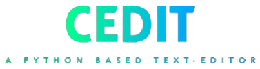
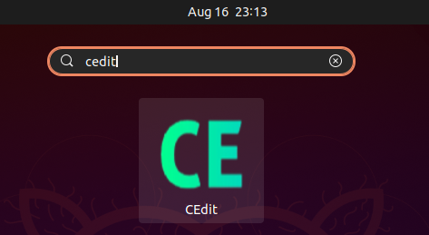
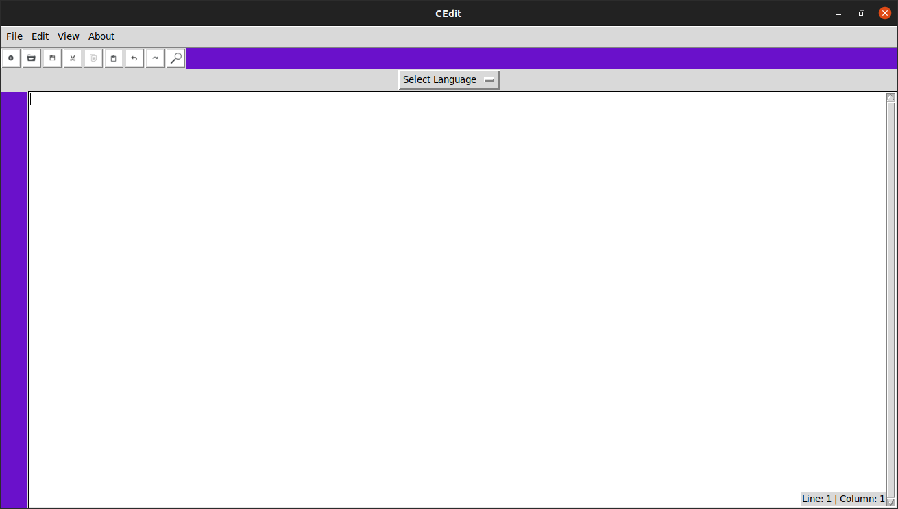
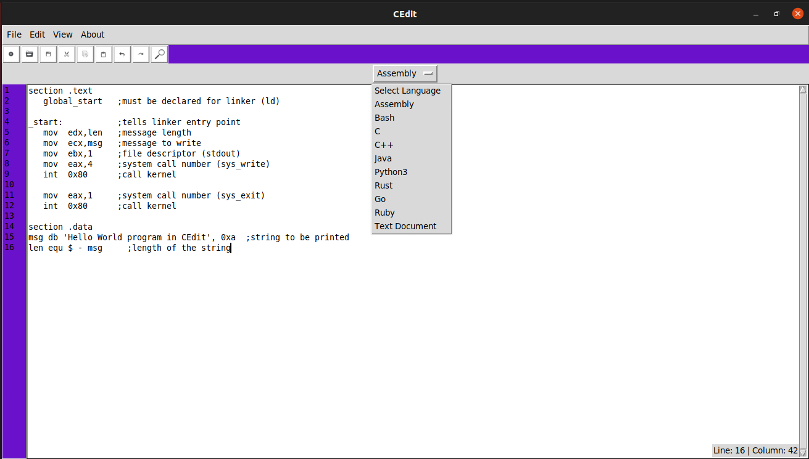
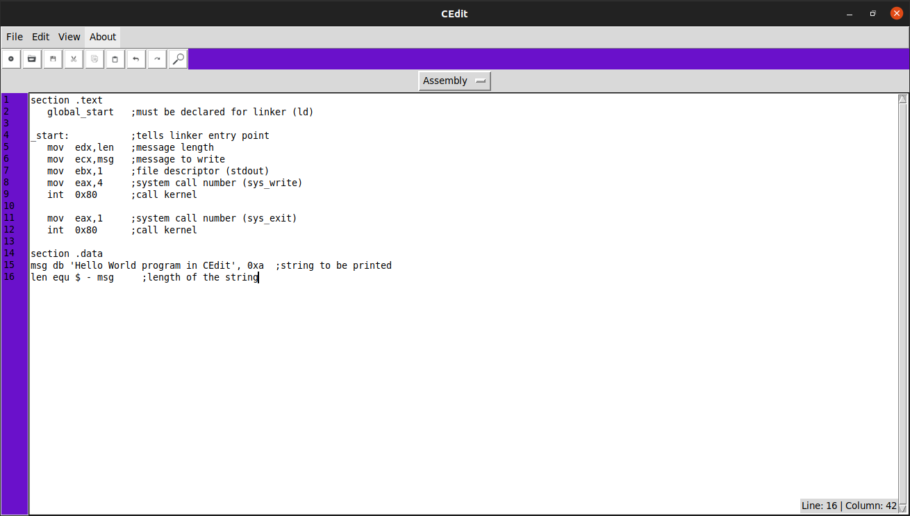
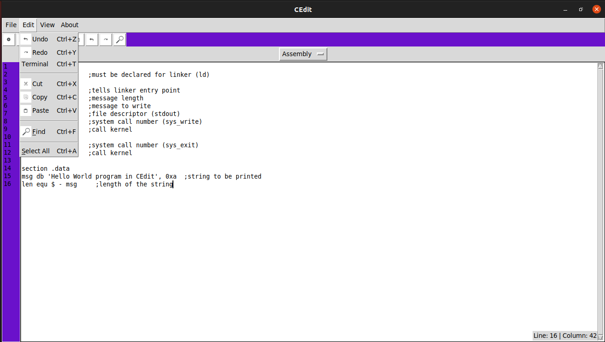
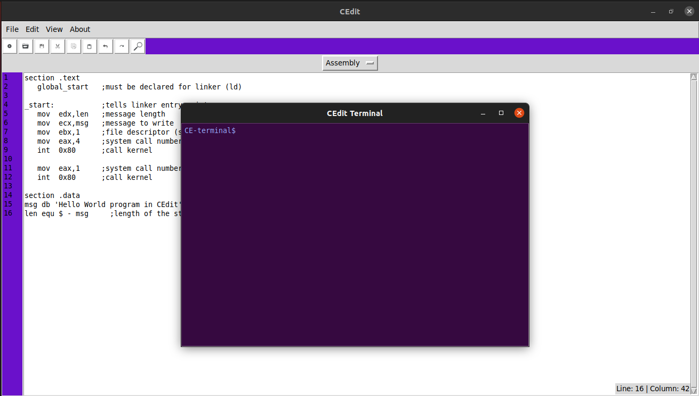

########
Overview
########

This page in this documentatiion is designed for understanding how the CEdit works...

    
  
.. _features:    
    
Features
========

As you have already read in the introduction page, this text-editor is fully made using python codes,
may include other programming languages in the future as well... As of now, CEdit can be used as desktop application.

    
For installing, check the installation page.

After successfull installation, you should see the below dialog opened automatically.

    
In this page you can select the programming language you are going to code. For example, if you select *Assembly* as an option, the you will get a **Hello World** program for selected programming language.

    
    

    
**CEdit** has *built-in* terminal too. First, click on **Edit** option. And select **Terminal** option in it. Now terminal is opened. Now you can give try the terminal commands from **CEdit-Terminal**.

    

If any error is encountered, feel free to post the issues in official `**Git** <https://bitbucket.org/Kapil_Shyam_M/cedit/>`_ Repository.
Now, checkout the installation page for installing CEdit successfully..

